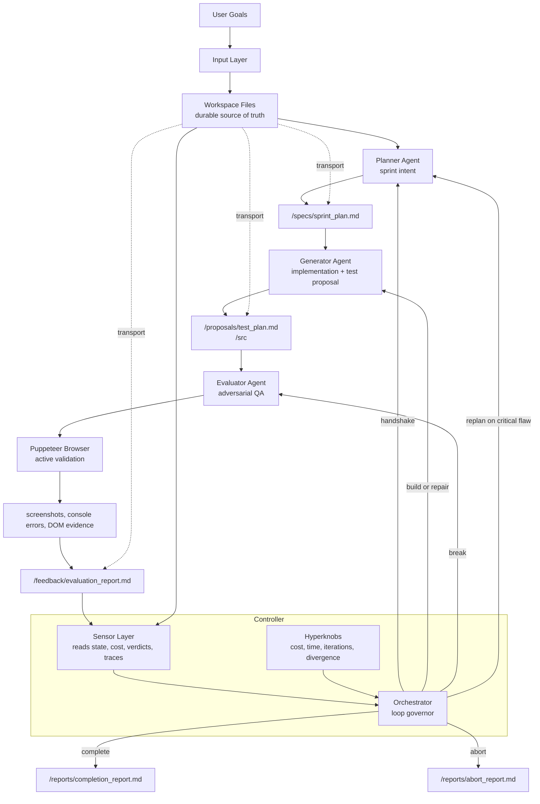
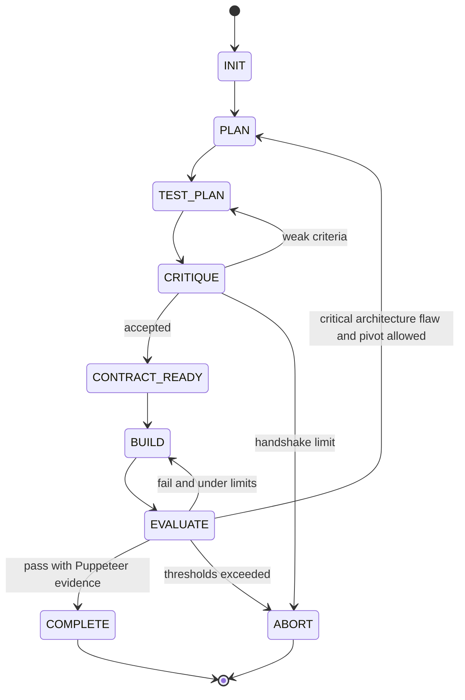

# Agent Harness

Agent Harness is a bounded, adversarial, long-running goal-seeking system for
building applications from user goals. It uses a strict three-node architecture:

- **Planner** converts raw goals into sprint intent.
- **Generator** turns a negotiated contract into code.
- **Evaluator** actively breaks the running app with Puppeteer and is the only
  role allowed to pass or fail work.

The Orchestrator governs the loop. It does not write application code, approve
work, or rely on hidden chat history. Durable state moves through files in the
workspace.

## Why Three Agents

The Generator is good at creating but biased toward its own output. The
Evaluator is deliberately separate and harsh, so approval requires independent
active validation. The Planner reframes goals and architecture when the loop
gets stuck or a critical design flaw appears.

## Core Laws

1. **No self-evaluation:** the Generator cannot mark work done.
2. **File-system negotiation:** all durable handoffs are Markdown or JSON files.
3. **Adversarial evaluation:** the Evaluator assumes the app is broken until
   browser evidence proves otherwise.
4. **Active validation:** final approval requires Puppeteer actions.
5. **Multi-model routing:** Planner, Generator, and Evaluator have distinct
   logical model configs.

## Setup

Recommended Conda setup for live LLM mode:

```bash
conda env create -f environment.yml
conda activate agent-harness
npm install
npm run puppeteer:install
cp .env.example .env
```

Fallback venv setup:

```bash
python3 -m venv .venv
source .venv/bin/activate
python -m pip install -e .
npm install
cd puppeteer && npm install && cd ..
cp .env.example .env
```

The local tests do not require cloud credentials:

```bash
python -m unittest discover -s tests
```

## Commands

```bash
python -m harness.main init
python -m harness.main run --goals goals.md
python -m harness.main status
python -m harness.main resume
python -m harness.main abort
python -m harness.main report
python -m harness.main doctor
python -m harness.main job-create --name "Daily goals" --goal "Build a landing page" --schedule "0 9,13,17 * * *"
python -m harness.main jobs
python -m harness.main job-run --job-id <job_id>
python -m harness.main connector-add-meta --name "Main Page" --page-id <page_id>
python -m harness.main connectors
python -m harness.main scheduler-status
```

## Local UI

The repository includes a Next.js console for testing the harness without cloud
LLMs. It forces deterministic local mode through `HARNESS_USE_LLM=false`.

```bash
npm install
npm run puppeteer:install
npm run dev
```

Open [http://localhost:3001](http://localhost:3001).

Port `3001` is used for the control console. Port `3000` is reserved for the
temporary app under test that the Evaluator opens with Puppeteer.

From the UI you can:

- enter or edit goals,
- initialize the workspace,
- run the Planner -> Generator -> Evaluator loop,
- resume or abort,
- create persistent background jobs with cron-like schedules,
- inspect and run saved jobs,
- register connector metadata such as a Meta Page ID and token environment variable,
- inspect loop state, sprint plan, contract, build log, evaluation report, and
  final report.
- run a preflight Doctor check.

The UI calls the Python harness through local Next.js API routes. It does not
send goals to any cloud model unless you explicitly enable LLM routing in the
environment.

By default, the harness uses deterministic local agent behavior so the loop can
be tested without credentials. Set `HARNESS_USE_LLM=true` and configure models
in `.env` to route through ADK/LiteLLM-backed agents.

When `HARNESS_USE_LLM=true`, start the Next.js UI from the same shell where the
environment is loaded. The browser API routes inherit that setting; otherwise
the UI remains in deterministic local mode.

## Background Jobs and Scheduler

The harness has a persistent job registry at:

```text
workspace/state/jobs.json
```

Jobs store status, schedule, approval state, run history, artifacts, and
redacted output. Prefect is the intended production scheduler. The adapter uses
Prefect when it is installed and falls back to the synchronous local job runner
when it is not, so local tests still work offline.

Install the scheduler stack through Conda:

```bash
conda env create -f environment.yml
conda activate agent-harness
```

Check scheduler capability:

```bash
python -m harness.main scheduler-status
```

The schedule string is stored on the job. A VPS deployment should run a Prefect
worker or deployment that pulls due jobs from the registry and executes
`run_job_with_optional_prefect`.

## FastAPI Control API

The FastAPI control plane exposes:

```text
GET  /health
GET  /jobs
POST /jobs
GET  /jobs/{job_id}
POST /jobs/{job_id}/approve
POST /jobs/{job_id}/run
GET  /runs
GET  /artifacts
GET  /connectors
```

Run it on a VPS or locally after installing the API dependencies:

```bash
uvicorn harness.api:app --host 0.0.0.0 --port 8088
```

## MCP Server

Claude Desktop should talk to the harness through the dedicated MCP server, not
a generic filesystem connector. The MCP surface exposes safe tools such as
`harness_set_goal`, `harness_run_goal`, `harness_create_job`, `harness_list_jobs`,
`harness_read_report`, and `harness_list_artifacts`.

Example Claude Desktop config:

```json
{
  "mcpServers": {
    "agent-harness": {
      "command": "/Users/roydellclarke/Documents/PlanGenEval/scripts/agent-harness-mcp",
      "args": [],
      "cwd": "/Users/roydellclarke/Documents/PlanGenEval",
      "env": {
        "HARNESS_WORKSPACE": "/Users/roydellclarke/Documents/PlanGenEval/workspace",
        "HARNESS_USE_LLM": "false"
      }
    }
  }
}
```

Before restarting Claude Desktop, smoke-test the same launcher:

```bash
/Users/roydellclarke/Documents/PlanGenEval/scripts/agent-harness-mcp --self-test
```

It should report `"jsonrpc_ok": true`.

## Connector Vault and Meta Publishing

The connector vault lives at:

```text
workspace/state/connectors.json
```

It stores connector metadata and environment variable names, not raw tokens. For
Meta/Facebook workflows, do not give the harness your Facebook password. Use
Meta OAuth/Page access tokens and keep publishing approval-gated.

Register a Meta Page connector:

```bash
export META_PAGE_ACCESS_TOKEN="your_oauth_page_token"
python -m harness.main connector-add-meta --name "Main Page" --page-id "<page_id>"
```

Publishing jobs are designed to require explicit approval and are dry-run first.
Real Graph API posting should only be enabled after OAuth, token rotation,
audit logs, and human approval gates are verified.

## Model Routing

Edit `.env`:

```env
HARNESS_USE_LLM=true
HARNESS_PYTHON=python3

PLANNER_MODEL=deepseek/deepseek-reasoner
GENERATOR_MODEL=moonshot/kimi-k2.5
EVALUATOR_MODEL=deepseek/deepseek-reasoner

DEEPSEEK_API_KEY=your_deepseek_key
MOONSHOT_API_KEY=your_kimi_or_moonshot_key

PLANNER_TEMPERATURE=0.25
GENERATOR_TEMPERATURE=0.35
EVALUATOR_TEMPERATURE=0.15
```

The code keeps each role as a separate logical endpoint even if you temporarily
use the same underlying model family.

Do not paste API keys into chat. Put them in `.env` or export them in the same
terminal where you start `npm run dev`.

## Cost Estimates

The cost log is written to:

```text
workspace/state/cost_log.json
```

When LiteLLM returns provider cost metadata, the harness records it directly.
When a direct OpenAI-compatible provider returns token counts but no billable
cost, the harness estimates cost with environment-configured per-million-token
rates:

```env
COST_DEEPSEEK_DEEPSEEK_REASONER_INPUT_USD_PER_1M=0.56
COST_DEEPSEEK_DEEPSEEK_REASONER_OUTPUT_USD_PER_1M=2.24
COST_MOONSHOT_INPUT_USD_PER_1M=0
COST_MOONSHOT_OUTPUT_USD_PER_1M=0
```

Update these values to match your current provider contract. A zero rate means
the harness will still log tokens but estimate `$0.00` for that provider.

## Hyperknobs

Bounds are configured by environment variables and mirrored into:

```text
workspace/state/loop_state.json
```

Important knobs include:

- `MAX_ITERATIONS_PER_SPRINT`
- `MIN_ITERATIONS_PER_SPRINT`
- `MAX_TOTAL_ITERATIONS`
- `MAX_WALL_CLOCK_MINUTES`
- `MAX_COST_USD`
- `MAX_REPEATED_FAILURE_COUNT`
- `MAX_CONTRACT_HANDSHAKE_ROUNDS`
- `DIVERGENCE_SCORE_THRESHOLD`
- `CONTEXT_RESET_EVERY_ITERATIONS`
- `REQUIRE_DESIGN_REVIEW_PASS`

## Workspace

The workspace is the context container:

```text
workspace/
  goals/ specs/ contracts/ src/ proposals/ feedback/
  state/ rubrics/ traces/ reports/ screenshots/
```

Agents read and write only through safe file tools that reject path traversal.

Structured run events are written to:

```text
workspace/state/events.jsonl
```

Each event includes a `run_id`, phase, event name, agent, iteration, and
redacted details. Use this file when debugging why the Orchestrator moved from
one phase to another.

## Puppeteer Validation

Only the Evaluator has Puppeteer access. The bridge exposes:

- `navigate`
- `click`
- `type`
- `screenshot`
- `get_console_errors`
- `get_page_text`
- `wait_for_selector`
- `evaluate_dom`

A `PASS` verdict without Puppeteer evidence is invalid when
`REQUIRE_PUPPETEER_FOR_PASS=true`.

## Architecture





## Critical Warning

This harness is not permanent infrastructure. After every major model upgrade,
manually inspect traces and re-evaluate whether adversarial separation is still
needed. If a newer model can reliably self-correct without sycophancy, simplify
or delete the harness.
